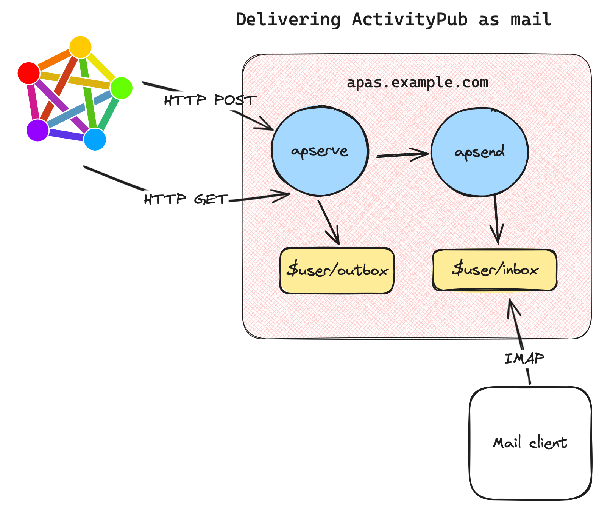

# Apas: ActivityPub via email

By Oliver Lowe <[o@olowe.co](mailto:o@olowe.co)> ([otl@apubtest2.srcbeat.com](https://apas.srcbeat.com/otl/actor.json))

> Every program attempts to expand until it can read mail.
> Those programs which cannot so expand are replaced by ones which can.

—[Zawinski's Law of Software Envelopment]

**[Source code]** | **[GoDoc]**

[Source code]: https://git.olowe.co/apub
[GoDoc]: https://godoc.org/olowe.co/apub

---

The most popular systems on the [ActivityPub]-speaking [Fediverse] are imitations of non-federated platforms.
[Mastodon] and [Misskey] are [Twitter] clones;
[Lemmy] is a [Reddit] clone.
But ActivityPub –
the protocol connecting all these systems together –
 is often said to be similar to email,
which involves exchanging messages.
In the case of at least Mastodon and Lemmy,
ActivityPub was implemented after the bulk of each sofware was designed.
Message exchange – federation by ActivityPub – is arguably a second-class citizen for these
traditional [CRUD] web applications backed by SQL databases and fronted by web browser UIs.

Apas is an experiment in exposing ActivityPub in a familiar and popular interface: email.
Its primary goal is to clarify how ActivityPub and the Fediverse work for the broader community.
A number of secondary goals are detailed later.

[CRUD]: https://en.wikipedia.org/wiki/Create,_read,_update_and_delete
[upas]: http://doc.cat-v.org/bell_labs/upas_mail_system/
## 1. Motivation

As a fan of [Plan 9] and a weirdo who likes to fiddle with network protocols for fun,
I was disappointed with what using Mastodon, Lemmy et al. felt like.

What excites me is *communication!*
Exchanging messages *between* people, systems, and places we can't think of yet!
It's what makes receiving even just a single email from a random person such a viscerally distinct experience from
thousands reading your post you uploaded somewhere.
We're communicating!

Implementing a subset of the Mastodon and Lemmy HTTP APIs in a couple of languages was relatively straightforward.
After writing some small clients and tooling
it felt like I was just dealing with platforms,
not a federated universe.
The pattern was familiar for many software developers:

* You create a post,
* that gets written to a database,
* you get an ID back, indicating success.

But the whole federation bit is obscured.
You hope that others can see that post... somehow...?
The platform thinking is evident in the language we see around these systems:
"I saw this on Lemmy", or "this is trending on Mastodon", or "find me on Akkoma".
Nobody says "find me on email" or "someone sent this on email".

Interoperability efforts fall flat when expertise in one system does not translate to another.
Moderation and tooling discussions are artificially limited to a particular system.
Should a plugin for Friendica filtering posts containing racist language only work with Friendica when all the systems work together?
Should it even be a plugin tied to one particular system in a particular programming language at all?

Finally, interoperability and portability is the "killer feature" of ActivityPub systems and any significant software system.
We know software developers can write standalone Twitter clones day-in, day-out.
But no amount of funding to Instagram or any other incumbent commercial platform
will ever make it available for
shitty government systems,
space stations,
embedded devices,
your grandmother,
charities,
snail mail,
VR headsets, and
automatic vacuum cleaners
*all at once*.

Writing better software systems often means communicating better.
That means understanding ActivityPub better.

## 2. Overview

**Apas** is mostly inspired by the [upas] email system available with [Plan 9];
a collection of small programs operate on files and streams,
relaying messages out to the Internet or
delivering to mailboxes on the filesystem.
(But it's so much more limited and poorly designed than upas that I was hesitant to even write this bit!)

An important difference from existing Fediverse software is that
**apas** only represents Activities as messages.
There are no application-specific data structures like
posts, toots, comments, or pages.
Messages can be files in a filesystem,
which simplifies implementation significantly.

### 2.1 Messages

**Apas** marshals ActivityPub objects into [RFC5322] messages and vice-versa.

The [Note Activity] is probably the most recognisable object exchanged by ActivityPub servers.
They are represented as comments by Lemmy, and posts (toots?) by Mastodon.
For instance, imagine a reply from Alex to Bowie talking about motorcycle tyres.
It's passed around the Fediverse as JSON-encoded data like this:

	{
		"type": "Note"
		"id": "https://apub.example.com/alex/12345678",
		"attributedTo": "https://apub.example.com/alex"
		"to": "https://apas.test.example/bowie/87654321",
		"cc": "https://apas.test.example/bowie/followers",
		"inReplyTo": "https://apas.test.example/bowie/87654321",
		"name": "Thoughts on 50/50 tyres"
		"content": "But what if you don't know when you want to ride off-road?",
	}

For **apas** this is equivalent to the mail message:

	From: "Alex " <alex@apub.example.com>
	To: "Bowie" <bowie@apas.test.example>
	CC: "Bowie (followers)" <bowie+followers@apas.test.example>
	Message-ID: <https://apub.example.com/alex/12345678>
	In-Reply-To: <https://apas.test.example/bowie/87654321>
	Subject: Thoughts on 50/50 tyres

	But what if you don't know when you want to ride off-road?

Unlike other Fediverse software,
the message to be distributed is written and read by people; not just machines.
For developers, administrators, and advanced users, seeing data like
this builds familiarity with the behaviour between systems,
and facilitates communication.
We go from "why can I see my toot on Kbin but not on Pleroma?" to
"why didn't your Pleroma server receive my message?"
which is a much easier question to answer; it's what the systems are actually doing.

If there was only one thing to take away from **apas**, it's that
familiarity with data over an API is hugely helpful for
troubleshooting. Especially when typical bug reports consist of URLs
to irrelevant web apps (or even just screenshots!) trying to explain
what was sent versus what was received. That's before we we even
address what could be in a database, itself requiring its own query
language and tightly-controlled administrative access to read.

[Note Activity]: https://www.w3.org/TR/activitystreams-vocabulary/#dfn-note

### 2.2. Sending

Presenting posts, comments, notes, etc. as a mail message immediately
clarifies a big source of confusion with existing systems:
why isn't my post showing up?
It becomes easier to reason about this when it is obvious where is a message is sent.
An email lists recipients explicitly.
When replying to a Kbin comment via Mastodon,
it takes knowledge of how each system is implemented to know who the
recipients are, if any.

Regular email clients
(or even any old text editor!)
provide an interactive way to test other AP systems.
For instance, we can easily test how the message is received if we address the recipient in the `CC` field instead of `To`,
or if we list the same recipient 20 times in both fields.
**Apas** could report deliverability errors either:

* immediately, or
* as a bounced message

At the moment, error messages are returned immediately.
This has provided a pleasant enough testing experience
that makes learning ActivityPub an interactive process,
directly from any mail client, especially compared with the
usual drudgery of sifting through logs of big web applications.

Sending is involves two programs each playing its own role:

1. Asubmission program accepts messages from authorised users, and
2. A mailer handles sending messages to the Internet.

#### 2.2.1. Submission

Messages are submitted to a server running `apsubmit`.
`apsubmit` is a SMTP server.
It listens for SMTP connections,
authenticates the session,
then passes the received message to the mailer `apsend`.

SMTP is a widely implemented protocol.
`apsubmit` enables
existing mail clients,
embededed devices,
and systems that I don't even know exist,
to publish to the Fediverse.

For personal use,
it has been fine using [mutt] via SSH on a Linux server,
[Sylpheed] on my OpenBSD laptop,
[MailMate] on a shared iMac,
and the built-in Mail app on my iPhone for replies.
I'll leave others to come up with more ideas;
keep in mind weather stations, printers, video records can usually
send email but definitely cannot speak ActivityPub!

For fast feedback,
`apsubmit` takes advantage of the `RCPT` stage of the SMTP transaction.
It verifies that listed recipients exist and have inboxes we can target.
This is in contrast with e.g. Mastodon,
which will always accept creating the following post:

	@john@nowhere.invalid @deleteduser@example.org what do you think?

There's several possible error conditions here. For `john`, perhaps:

* their server is down and messages are undeliverable,
* their Actor is misconfigured and is missing an `inbox` endpoint,
* the address is totally invalid

For `deleteduser`, perhaps the account no longer exists.
Mastodon never notifies of any delivery errors.
We could ask the server administrators to trawl through the server's logs for us,
or ask `johnny` and `deleteduser` out-of-band if they got our message.
Accounting for some common errors at submission time obviates that extra work.

#### 2.2.2 Mailer

Sending messages is performed by a command-line utility called `apsend`.
`apsend` reads a message from standard input and disposes of it based on the recipients.
If the above message from Alex to Bowie was in a file called "note.eml",
we could send it with the following shell command:

	apsend -t < file.eml

In general, `apsend` is not intended to be executed directly.
Instead, a frontend like an email client (sending via SMTP)
or a tool like Plan 9's [marshal(1)]
should be used which take care of adding entries to and formatting the
header correctly.

[marshal(1)]: https://9p.io/magic/man2html?man=marshal&sect=1

### 2.3 Receiving

Core to **apas** is handling ActivityPub objects as files in a filesystem.
This reveals there are many different ways to retrieve Activitity from the Fediverse
beyond the typical process of servers sending Activity to an Actor's inbox.
**Apas** of course supports this (see 2.3.2),
but it's worth mentioning other techniques to show how flexible
working with the Fediverse can be.
It may also help clarify discussions on user privacy.

#### 2.3.1 Direct

This was the first implementation of receiving ActivityPub objects for **apas**.
The command `apget` fetches the Activity at a URL, then writes it to the standard output.
Throughout testing, I ran the tool in shell scripts like the below to deliver messages to my inbox:

	apget https://apub.example.com/alex/12345678 | apsend otl

Little shell scripts can fetch a series of posts:

	for i in `seq 12345671 12345678`
	do
		apget -m https://apub.example.com/alex/$i
	done

Obviously this is inefficient compared to other methods,
but we're not Google.
Handy ad-hoc testing.

#### 2.3.2 Targeting the ActivityPub inbox

This is the typical ActivityPub process.
For example, someone could mention us in a Mastodon post:

	@bowie@apas.test.example hope apas is going OK!

Which results in the Mastodon server sending Activity to bowie's Actor inbox.
In **apas**,
`apserve` provides a typical HTTP server for a minimal ActivityPub service.
It is responsible for:

* receiving Activity over HTTP (ActivityPub inbox)
* serving users' sent Activity for other servers to fetch (ActivityPub outbox)
* serving each user's Actor
* resolving WebFinger lookups

Delivery is not handled by `apserve`.
Instead, `apserve` converts Activities to mail messages,
and passes them on to `apsend` for delivery.

#### 2.3.2 Following

[Follows] can be sent using `apsend`.
Because Follows are not represented clearly as mail,
the Follow needs to be written as JSON directly.
For example, for user bowie to follow alex:

	{
		"@context": "https://www.w3.org/ns/activitystreams"
		"actor": "https://apas.example.org/bowie",
		"type": "Follow",
		"object": "https://apub.example.com/alex"
	}

then piped to `apsend`:

	apsend -j alex@apub.example.com < follow.json

Wrapped up in X-line shell script named `apfollow`,
following and unfollowing is equivalent to running the commands:

	apfollow alex@apub.example.com
	apfollow -u alex@apub.example.com

#### 2.3.3 RSS/Atom feeds

Many ActivityPub servers also make content available via [web feeds].
This could be an efficient way to fetch content using a battle-tested format
from resource-constrained servers.

One possible tool is something that manages reading new entries in a feed.
For each entry, it extracts the ActivityPub object ID from the
 `<guid>` or `<link>` tag for RSS and Atom respectively.

	<entry>
		<title>Atom-Powered Robots Run Amok</title>
		<link href="https://apub.example.com/alex/12345678"/>
		<id>urn:uuid:1225c695-cfb8-4ebb-aaaa-80da344efa6a</id>
		<updated>2023-12-13T18:30:02Z</updated>
		
hello, world!

	</entry>

#### 2.3.4 Fediverse software HTTP APIs

Many existing systems provide a HTTP API which provides a convenient
way of finding content based on some application-specific logic e.g.
a group, full-text search, or time created.

An early **apas** prototype was really just a Python script which
synchronised my [GoToSocial] (like Mastodon) timeline with a directory on disk.
In short:

	for status in timeline():
		note = apget(status.source_id)
		with open(status.id) as f:
			apub2email(f, note)

#### 2.3.5 Takeaway

As mentioned already,
core to **apas** is handling ActivityPub objects
as text streams and
files in a filesystem.
It's not meant to be the most performant system (not to say that it's slow),
but it lets us develop an understanding of the ActivityPub protocol
and focus on the data over APIs via quick prototyping.

[web feeds]: https://www.rfc-editor.org/rfc/rfc4287
[Follows]: https://www.w3.org/TR/activitystreams-vocabulary/#dfn-follow
[GoToSocial]: https://gotosocial.org

#### 2.x TODO Filtering, spam?

- text streams
- small portable programs instead of plugins to growing systems

### 2.4 Reading

Messages are stored in the [Maildir] format; one message per file.
This is not an important part of the system.
Maildir is used only because of the easy implementation for `apsend`;
it just neads to create create files.

How messages are presented to users –
no matter how they are stored –
is a job for which software has been written for decades already.

Here are some that are being used or

#### 2.4.1 `read()`

No, really.

During development, being able to just run cat(1) on a file to debug Content-Type encoding bug
was a breath of fresh air when compared to what is more common in web development.

That is, running a unit test which queries a relational database running in a container in a virtual machine hopefully all configured correctly, then marshalling that into the application's unique data structure, to ActivityPub, then finally JSON-encoded (half-joking).

#### 2.4.2 Existing solutions

**Maildir**. Some clients can interact with Maildir directly, like [mutt].

**IMAP**. The obvious and most popular method for accessing mailboxes over the network. Dovecot works well. IMAP is very widely supported by mail clients.

**NNTP/Usenet**.
Throughout this document I've referred to "mail messages".
But the so-called "Internet Message Format" described in RFC 5322 is also used by
[Usenet] via a protocol known as [NNTP].
The protocol is a simple line-based text protocol
with many open-source libraries available.
Serving Fediverse messages from a filesystem over NNTP would be a fun project.
Similar to how the Linux Kernel Mailing list is available over NNTP at `nntp.lore.kernel.org`.

**Mailing list archive web interfaces**.
Finally yet another opportunity to give those old Perl scripts another lease of life.

**upasfs(4)**.
[upas] is the system I studied to implement **apas**.
Messages could be relayed from `apsend` to `upas/send`,
or the Maildir could be converted to mdir(6).
Then we would have a *real* filesystem interface over 9P.
Another project for another time.

[Maildir]: https://en.wikipedia.org/wiki/Maildir
[Usenet]: https://en.wikipedia.org/wiki/Usenet
[NNTP]: https://datatracker.ietf.org/doc/html/rfc3977

## 3. Workarounds & limitations

The mapping between Activity objects, mail messages,
ActivityPub HTTP methods, and SMTP transactions
has a number of limitations.
**Apas** uses some workarounds internally to fill some gaps.

The [Mention] Activity,
used by Mastodon for notifications,
is implemented by reading the To field of submitted messages.
Recipients in `To` are added as Mentions.
For example, the message:

	To: "Oliver Lowe" <otl@hachyderm.io>

	Hello!

results in an entry in `tags` in an ActivityPub Note:

	{
		"type": "Note"
		...
		"tags": {[
			"type": "Mention",
			"href": "https://hachyderm.io/users/otl",
			"name": "@otl@hachyderm.io"
		]}
	}

There is not an easy way to address an Actor's followers using the `acct:` mail address syntax.
`apas` understands a non-standard syntax using "plus addressing".
For example to address the followers of user@example.com
the address user+followers@example.com may be used.
These followers addresses cannot be resolved by WebFinger.

Likes and Dislikes are silently dropped by `apserve`.
The reader can decide whether this is a workaround, feature, or bug.

Accept and Rejects from Follow requests can be received via ActivityPub
and delivered as mail but for notifications only.
The reverse does not work;
**apas** cannot read a Follow request from a mail message.

To simplifly delivery to local mailboxes,
Actors served by `apserve` have no shared inbox/outbox.
Fortunately shared inbox endpoints are inteded as a performance opimitisation for
servers hosting many Actors, which is beyond the scope of **apas**.

[Zawinski's Law of Software Envelopment]: https://en.wikipedia.org/wiki/Jamie_Zawinski#Zawinski's_Law
[NetNewsWire]: https://netnewswire.com
[mutt]: http://www.mutt.org
[MailMate]: https://freron.com
[Sylpheed]: https://sylpheed.sraoss.jp/en/

[ActivityPub]: https://en.wikipedia.org/wiki/ActivityPub
[Misskey]: https://misskey-hub.net
[Twitter]: https://en.wikipedia.org/wiki/Twitter
[Reddit]: https://en.wikipedia.org/wiki/Reddit

[Mention]: https://www.w3.org/TR/activitystreams-vocabulary/#microsyntaxes

[2023 Reddit API controversy]: https://en.wikipedia.org/wiki/2023_Reddit_API_controversy
[3rd Party Twitter Apps]: https://www.theverge.com/2023/1/22/23564460/twitter-third-party-apps-history-contributions
[Lemmy]: https://join-lemmy.org
[Mastodon]: https://joinmastodon.org
[RFC5322]: https://www.rfc-editor.org/rfc/rfc5322
[Plan 9]: http://9p.io/plan9/
